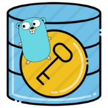
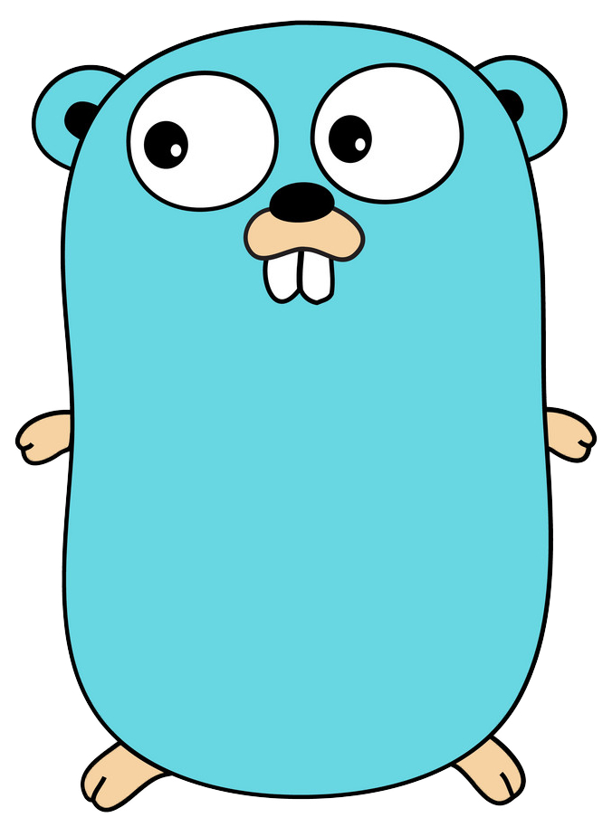
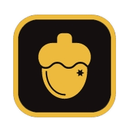
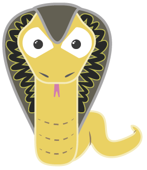

## KVStok

[](https://github.com/waldirborbajr/kvstok/actions/workflows/test.yaml)
[](https://github.com/waldirborbajr/kvstok/actions/workflows/codeql-analysis.yaml)
[](https://github.com/waldirborbajr/kvstok/actions/workflows/gorelease.yaml)

<p align="center">  </p>

KVStoK is an open source software built-in with the main aim of being a personal [KEY][VALUE] store, to keep system variables as parameters or passwords or anything else stored in a single place.

### How to use

```sh

# Store a value
$ kvstok addkv containerpwd 123SecretPWD

# List all stored values if informed json will generate a json file
$ kvstok listkv [json]

# Grab a value stored into a key
$ kvstok getkv containerpwd
123SecretPWD

# Remove a stored key/value from database storage
$ kvstok delkv containerpwd

# Unicode params are allowed too
$ kvstok addkv someParam 喵
$ kvstok getkv someParam
喵
```

### Integrated to shell script

```sh
#!/bin/bash

dosomething = $(kvstok getkv someParam)
echo ${dosomething}
..
.
```

### Installation

Make sure that `$HOME/.local/bin` it is in your library path.


```sh

$ cd ~/.local/bin

$ curl -LO https://github.com/WaldirBorbaJR/kvstok/-/blob/main/bin/kvstok

```

## How can I contribute?

Kindly refer to [CONTRIBUTING.md](./CONTRIBUTING.md) file to learn how to contribute!

And that's it!
Follow these steps to make your very first pull request.

## License

[Apache](https://github.com/WaldirBorbaJR/kvstok/-/blob/main/LICENSE)

## Legal

Copyright 2022 Waldir Borba Junior (<mailto:wborbajr@gmail.com>)
SPDX-License-Identifier: Apache-2.0

## TODO

**Note: This file is no longer being updated.**

The todo file does not represent ALL of the missing features. This file just shows the features which I noticed were missing and I have to implement.

[TODO](./TODO.md)

## Technology

|  |  |  |  |


[KVStoK]|[GO](https://go.dev/)|[NutsDB](https://github.com/nutsdb/nutsdb)|[Cobra](https://cobra.dev/)|
